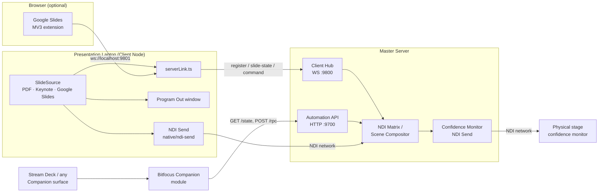

# Presentation Commander — Server

> **AI-assisted project.** This codebase was created with [Claude](https://claude.com/claude-code)
> (Anthropic), directed and reviewed by a human author — including architecture,
> implementation, and documentation. Review it accordingly before relying on it in
> production.

The master control application for live event production: a real-time NDI
video matrix router, layered scene compositor, and presenter-notes hub,
built as an Electron + React + TypeScript desktop app.

Pairs with [presentation-commander-client](https://github.com/allansargeant/presentation-commander-client),
the companion app that runs on each presentation laptop.


## What it does

- **Source Pool** — add/edit/delete NDI and web sources, or pick a real NDI
  sender discovered live on the network (mDNS `_ndi._tcp.local`)
- **Scenes** — layered scene compositor: build scenes from multiple layered
  sources, drag to reposition, drag a corner to resize, toggle visibility.
  Layers backed by a real network source show a **live video preview**
  rendered from actual received NDI frames, not a placeholder box
- **Matrix Inspector** — route any physical/stream/stage output to a source
  or a full composited scene
- **Control Deck** — live presenter notes and slide position per connected
  Client Node
- **Control Surface** — a button-grid control surface: scene recall, blackout,
  next/previous slide, send-note-to-stage — all backed by the same command
  path used by the JSON-RPC automation API (`:9700`), which also powers the
  [Bitfocus Companion module](https://github.com/allansargeant/companion-module-presentationcommander-server)
  for Stream Deck integration
- **Confidence Monitor** — a `Presenter Notes` source type composites live
  presenter notes over video into one real NDI output (`native/ndi-send`,
  the same addon architecture as the Client's NDI send), so a physical
  stage monitor gets an actual broadcast signal instead of a text box in
  the operator's own window
- **Client Hub** (`:9800`) — WebSocket server that Client Nodes register
  with; connected clients automatically appear as routable sources, and
  next/previous-slide commands are forwarded live to the client instead of
  being simulated locally

## Architecture



## What's real vs. mocked

NDI **discovery and receive are real**, built directly against the official
[Vizrt NDI SDK](https://ndi.video/for-developers/ndi-sdk/) via a small
native N-API addon (`native/ndi-receive`) — no third-party NDI wrapper.
Source discovery uses mDNS; the scene compositor's layer previews are
actual decoded video frames pulled from the network with
`NDIlib_recv_capture_v3`. DeckLink capture cards and other physical
broadcast hardware are still out of scope — this project has no way to
test against hardware it doesn't have.

### Building from source

The native receive addon links against the NDI SDK at build time. Install
the [NDI SDK](https://ndi.video/for-developers/ndi-sdk/) first (macOS
default: `/Library/NDI SDK for Apple`; override the location with
`NDI_SDK_DIR` if yours lives elsewhere). `npm install` rebuilds the addon
automatically via `@electron/rebuild`.

## Roadmap / TODO

- [ ] **Physical capture hardware** — DeckLink capture cards and other broadcast I/O are currently out of scope; the project has no way to test against hardware it doesn't have. NDI discovery/receive and the compositor are real (see "What's real vs. mocked" above).

## Project Setup

### Install

```bash
npm install
```

### Development

```bash
npm run dev
```

### Build

```bash
# Windows
npm run build:win

# macOS
npm run build:mac

# Linux
npm run build:linux
```

## Unsigned builds — macOS Gatekeeper & Windows SmartScreen

The release builds are **not code-signed or notarized** — that needs paid Apple
/ Windows developer certificates this project doesn't carry. The app is safe to
run; the OS just can't verify a publisher, so it warns you the first time.
Here's how to get past that, and how to sign it yourself if you'd rather.

### macOS

Delivered as a `.dmg`/`.zip`. On first launch macOS says the app **"is damaged
and can't be opened"** or **"cannot be opened because the developer cannot be
verified"** — that's Gatekeeper reacting to the missing signature, not an actual
problem.

Easiest fix: **right-click (Control-click) the app in Applications → Open →
Open**. You only do this once. If it still says *"damaged"* (common when the
`.dmg` came through a browser), clear the quarantine flag in Terminal:

```sh
xattr -dr com.apple.quarantine "/Applications/Presentation Commander Server.app"
```

### Windows

The installer is an unsigned `.exe`, so SmartScreen shows **"Windows protected
your PC"** → click **More info → Run anyway**. (Right-click → **Properties** →
**Unblock** also works.)

### Linux

`.AppImage`: `chmod +x` it and run. `.deb`: `sudo apt install ./<file>.deb`. No
signing gate.

### Signing it yourself (optional)

macOS ad-hoc (local only, not notarized):

```sh
codesign --force --deep --sign - "/Applications/Presentation Commander Server.app"
```

To ship without warnings you need an **Apple Developer Program** membership
($99/yr) + a *Developer ID Application* certificate, then sign with the hardened
runtime and notarize with `xcrun notarytool submit … --wait` and
`xcrun stapler staple`. electron-builder does all of this for you if you set
`CSC_LINK`, `CSC_KEY_PASSWORD`, `APPLE_ID`, `APPLE_APP_SPECIFIC_PASSWORD` and
`APPLE_TEAM_ID`. On Windows, clearing SmartScreen needs an Authenticode
code-signing certificate (`signtool sign`, or `CSC_LINK`/`CSC_KEY_PASSWORD` for
electron-builder).

## Recommended IDE Setup

- [VSCode](https://code.visualstudio.com/) + [ESLint](https://marketplace.visualstudio.com/items?itemName=dbaeumer.vscode-eslint) + [Prettier](https://marketplace.visualstudio.com/items?itemName=esbenp.prettier-vscode)
